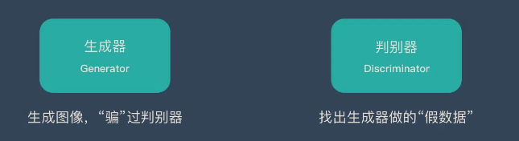
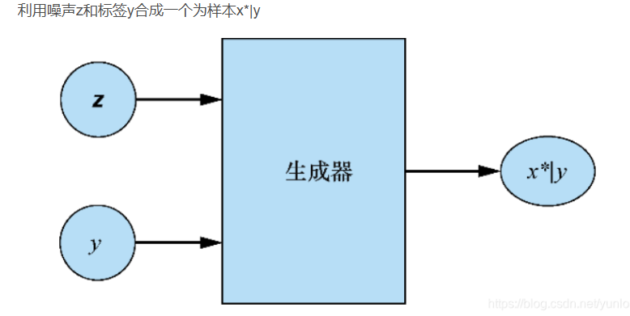
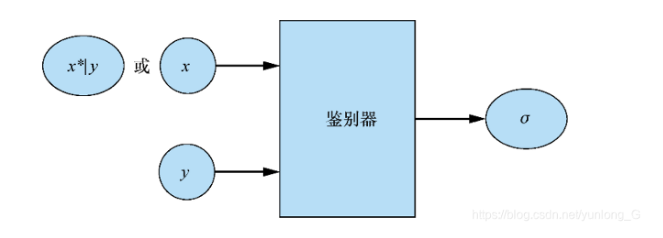

# CGAN - 条件生成对抗神经网络

### GAN  -  生成对抗神经网络

无监督算法

1. **生成器(Generator**)：通过机器生成数据（大部分情况下是图像），目的是“骗过”判别器
2. **判别器(Discriminator**)：判断这张图像是真实的还是机器生成的，目的是找出生成器做的“假数据”

**第一阶段：固定“判别器D”，训练“生成器G”**

​	对于判别器的判别能力不提高，提高生成器生成假数据的能力

**第二阶段：固定“生成器G”，训练“判别器D”**

​	与第一阶段相反，训练判别器使得判别器的判别能力提高，指导生成器所生成的假数据无法骗过判别器

**循环阶段一和阶段二**

### CGAN  - 条件生成对抗神经网络

**GAN（生成对抗网络）：**

- GAN由一个生成器（Generator）和一个判别器（Discriminator）组成。
- 生成器试图生成逼真的数据，使得判别器无法区分生成数据和真实数据。
- 判别器试图将生成数据和真实数据区分开来。
- 生成器和判别器通过一个对抗过程进行训练，生成器试图欺骗判别器，而判别器试图识别生成的数据。

**CGAN（条件生成对抗网络）：**

- CGAN在GAN的基础上增加了一个条件信息输入。
- 条件信息可以是任何形式的数据，比如标签、文本描述、图像等。
- 生成器不仅接收随机噪声作为输入，还接收条件信息，以生成符合条件的样本。
- 判别器在判断数据真假时也会考虑条件信息，从而进行更有针对性的判断。