# LSTM(Long Short Term Memory)

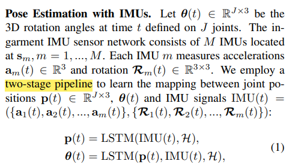

一个特殊的**递归神经网络（RNN）**；可以利用时间序列对输入进行分析；

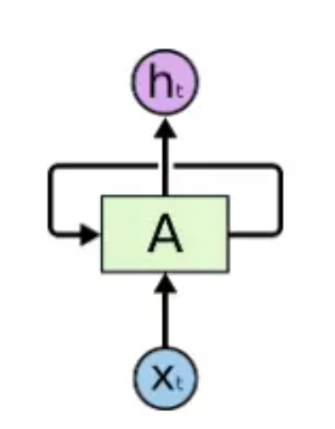

简单的**递归神经网络** - 只能解决上下文较接近的问题，无法解决长期依赖问题

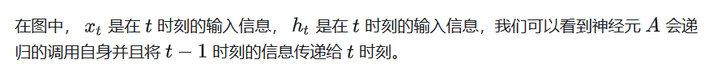

### **存在问题：**

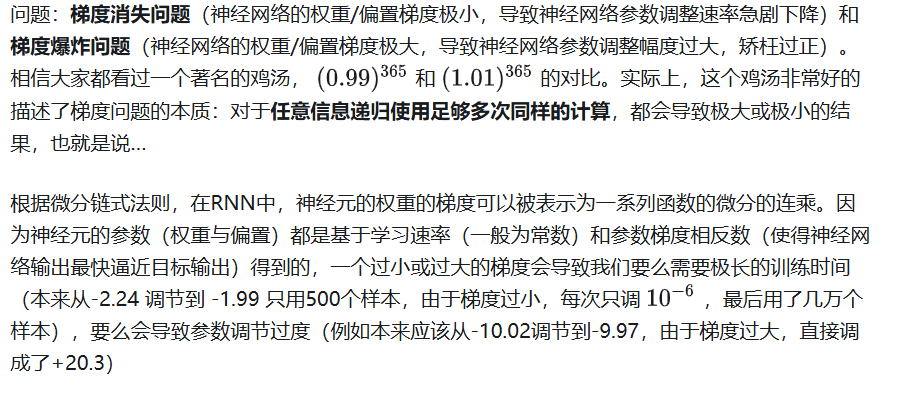

### **LSTM解决问题：**

普遍存在的**长期依赖问题**，使用LSTM可以**有效的传递和表达长时间序列中的信息并且不会导致长时间前的有用信息被忽略（遗忘）**。与此同时，LSTM还可以**解决RNN中的梯度消失/爆炸问题。**

### LSTM机制 - 长短期记忆（LM）

- 只有一部分信息需要长期记忆
- 记忆价值随时间序列衰减
- 价值低于阈值 - 遗忘

### LSTM具体解释：

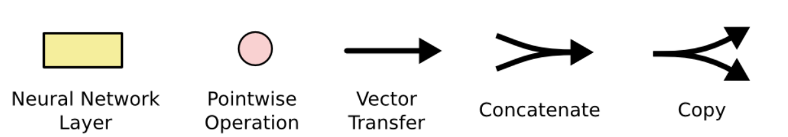

- Neural Network：神经网络层
- Pointwise Operation：操作（向量和等）

#### 标准RNN中的重复模块结构：

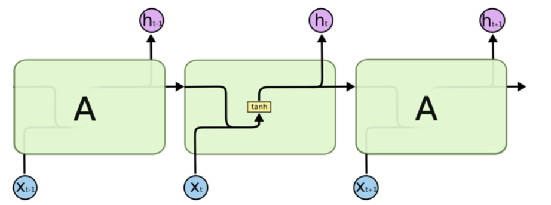

A在 𝑡−1 时刻的输出值 ℎ𝑡−1 被复制到了 𝑡 时刻，与 𝑡 时刻的输入 𝑥𝑡 整合后经过一个带权重和偏置的tanh函数后形成输出，并继续将数据复制到 𝑡+1 时刻……

#### tanh双曲正切函数 - 将函数映射到-1到1（防止输出过大或过小）

双曲正切函数是双曲函数的一种。双曲正切函数在数学语言上一般写作 tanh。它解决了Sigmoid函数的不以0为中心输出问题，然而，梯度消失的问题和幂运算的问题仍然存在。

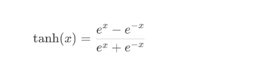

在RNN的隐藏层中，tanh函数被用来处理当前时刻的输入和前一时刻的隐藏状态，生成当前时刻的隐藏状态。具体公式为：
$$
h_t = \tanh(W_h \cdot h_{t-1} + W_x \cdot x_t + b)
$$
其中，$$h_t$$是当前时刻的隐藏状态，$$h_{t-1}$$是前一时刻的隐藏状态，$$x_t$$是当前时刻的输入，$$W_h$$ 和$$W_x$$ 是权重矩阵，b 是偏置。

**tanh函数图像：**

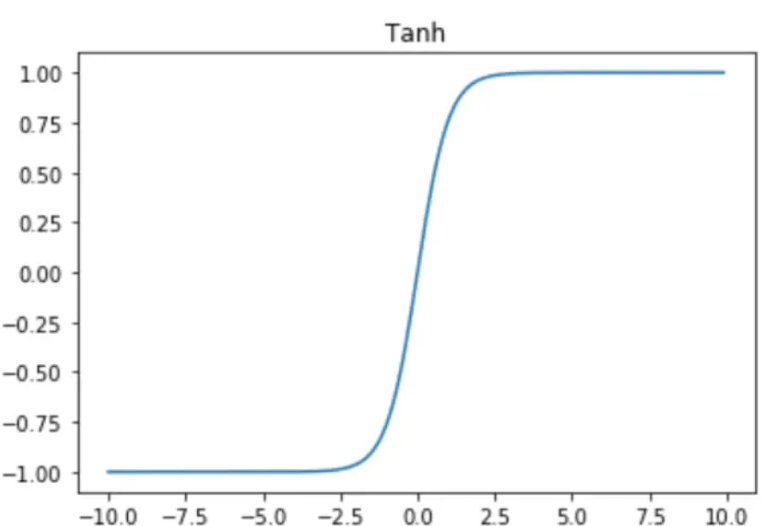

#### LSTM重复模块结构：

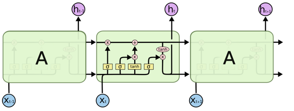

#### 单元状态 - 进行记忆传递

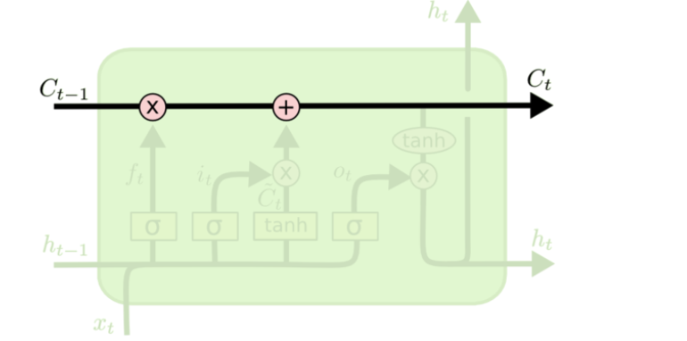

- $$C_{t-1}$$：传入之前的单元状态
- 通过与遗忘向量相乘，得到该单元需要记住的部分
- 再加上当前单元状态
- 传给下一单元

#### 遗忘门 

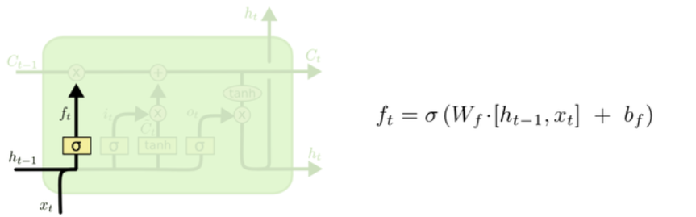

对于之前的记忆，选择将部分忘记：

- 依据上一刻的输出$$h_{t-1}$$和当前的输入$$x_{t}$$，决定丢弃的信息
- 使用`sigmoid`函数，产生(0, 1)之间数值，决定遗忘的程度

#### 记忆门

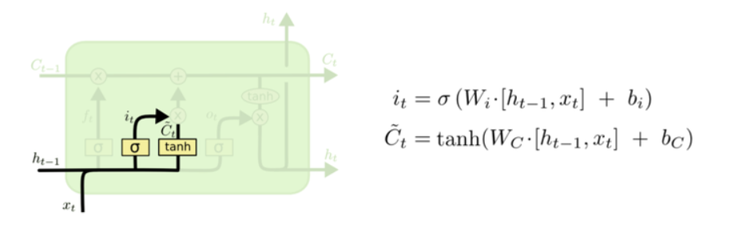

- 使用`tanh`提取输入中的有效信息
- 使用`sigmoid`决定哪些信息需要记住（与遗忘门同理）

#### 输出门

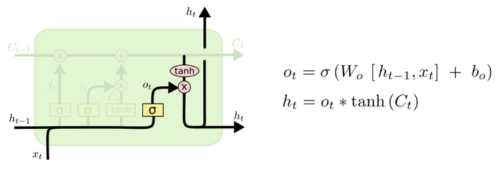

- 使用`tanh`处理当前细胞状态，得到一个在 -1 到 1 之间的值
- 使用`sigmoid`层选择当前细胞状态需要向后输出的部分