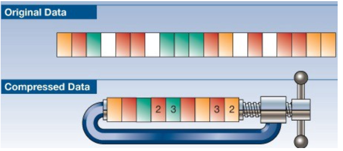
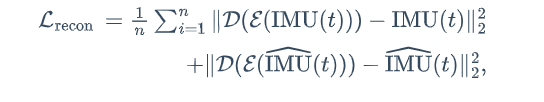

# Latent Space

### `压缩数据的表示`

为什么进行数据压缩? - 使用比原始表示更少的位来编码信息的过程。比如一共数据点是19D的数据点，即需要19个值来定义唯一点，然后将所有这些信息压缩到一个9D数据点中。如下图所示：

**有损压缩：**有损数据压缩（英语：lossy compression）是一种数据压缩方法，经过此方法压缩、解压的数据会与原始数据不同但是非常接近。它是与无损数据压缩相对的压缩方法。有损数据压缩又称破坏性资料压缩、有损压缩、不可逆压缩。有损数据压缩借由将次要的数据舍弃，牺牲一些质量来减少数据量、提高压缩比。

**自编码器使用的标准MSE重建损失**MSE

#### 我的理解：

​	机器学习的过程中，参数量大意味着更高的时间和经济成本，为了减少成本并且提高模型的性能，需要将数据进行编码解码的过程（压缩，解压）-> `用更少的参数量描述特征`,而这个经过编码的数据成为**潜空间**，但是在编解码的过程中为了追求压缩度，往往都是有损压缩，在编码和解码的过程中会对数据本身造成损失，故在机器学习的过程中引入了**重建损失**，作为机器学习中指导学习的损失函数的一部分；