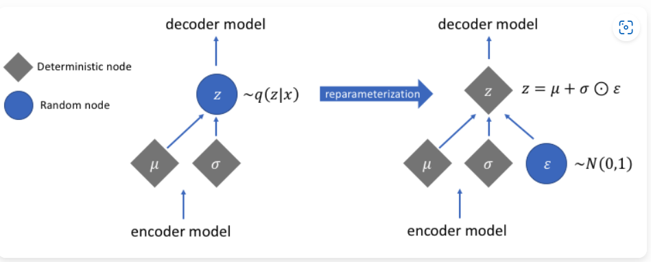

# The Reparameterization Trick 

## Gaussian Distribution Basics

当 $$\mu$$ 保持不变时，改变 $$\sigma$$ 会导致分布宽度的变化。同样，调整 $$\mu$$ 会移动分布峰值的位置。

## Backpropagating Over Randomness

反向传播就像老师引导学生纠正错误。但是当面对一个随机采样的变量时，这就像老师说：“自己搞清楚这个随机结果是如何影响你的错误的。”这不像纠正一个常规的数学问题那么简单

现在让我们想象一个神经网络需要从数据中学习。假设在我们的神经网络中有一个节点，它从均值 $$\mu$$和标准差$$\sigma$$的高斯分布中采样一个变量（我们称之为$$z$$）。在这种情况下，传统的反向传播难以计算导数，因为最终输出无法知道哪些输入导致了采样到的$$z$$ 变量。

## Reparameterization Trick

专注于某些参数的学习

> 引入重参数化技巧。这一巧妙的技术使我们能够绕过在随机采样变量上的反向传播难题。我们不再将随机性留在网络节点内部，而是将其移到外部，使其变成确定性的。
>
> 延续我们之前纠正错误的类比，重参数化技巧就像老师说：“好的，我看到你的学习取决于你的专注力和学习时间。我知道背景噪音可能会影响你的专注力，但噪音是我们无法控制的。所以，让我们尝试优化你的专注力和学习时间吧。”
>
> 回到神经网络中，我们不再从具有给定均值和方差的正态分布中采样随机节点，而是将随机性提取为一个不需要优化的独立输入。
>
> 
>
> 换句话说，重参数化技巧通过使用一个函数（我们称之为 f）提供了一种解决方法，该函数将已知分布（通常是均值为零、标准差为一的简单正态分布）进行转换。这个函数 f 取一个来自已知分布的随机变量（通常记作 $$\epsilon$$），并通过结合均值 $$\mu$$ 和标准差 $$\sigma$$，模拟出从目标分布采样的效果。
>
> 因此，与其使用传统的定义来采样$$z$$，我们使用重参数化技巧将其表示为：
>
> $$z = f(\mu, \sigma, \epsilon) = \mu + \sigma \cdot \epsilon$$
>
> 其中，$$\epsilon$$是从标准正态分布 $$\mathcal{N}(0, 1)$$中采样的随机噪声。

