# Loose Inertial Poser: Motion Capture with IMU-attached Loose-Wear Jacket

****

### key words:

- **IMU（Inertial Measurement Unit）:**一种电子设备，用于测量物体的运动状态。
  - IMU通过加速度计和陀螺仪测量的实时数据，可以计算出物体的运动轨迹、速度、位置和姿态（姿势和方向）。磁力计则用于提供方向参考，以帮助提高测量的精度。
- **SeMo-AE（Secondary Motion AutoEncoder）**:团队所提出的二次运动自动编码器
- **latent space（隐空间） ：**表示数据潜在特征或属性的多维向量空间 
  - 基于数据降维和特征学习的思想
    - 数据降维：去除数据当中的冗余与噪声，降低数据的维度，注重于保留数据中的关键信息与结构
    - 特征学习：通过编码器学习数据的潜在特征
- **Gaussian distribution**（高斯分布，SeMo—AE假设中出现）：正态分布
- **RNN（Recurssion Neural Network）：**递归神经网络
- **LSTM(Long Short Term Memory):**特殊的**递归神经网络**,可以利用时间序列对输入进行分析
  - 合理运用 𝑡 或之前的输入来处理 𝑡+𝑛 时刻,可以更加合理的运用输入的信息
- **two-stage pipeline：**一种处理流程设计方法
- **reparameterization:**是一种用于深度学习模型中的技术,实现梯度的有效传递，以便模型能够通过标准的反向传播算法进行训练
- **Maximum Mean Discrepancy (MMD):**是一种用于衡量两个概率分布之间差异的非参数统计方法
- **TailorNet:**是一种可以快速模拟服装模型的工具
- **Adam:**一种常用的梯度下降优化算法,结合了动量方法和自适应学习率调整的特性，以更高效地更新模型参数。
- **Ablation Study**消融实验 是一种科学研究方法，旨在评估一个复杂系统中各个组成部分的贡献或重要性。在消融实验中，研究人员通过逐步移除系统的一个或多个组件（称为"消融"）来观察系统整体性能的变化。

****

### Abstract

- 4个IMU集成到宽松夹克
- 提出SeMo-AE（学习建模和综合皮肤和宽松衣服之间的二次运动对于IMU数据的影响）
  - 解决缺乏宽松穿着IMU训练数据问题
  - 由两种新技术组成
    - noise-guided latent space learning（噪声引导隐空间学习）：将噪声建模过程转换为隐空间建模，可以轻易的推断二次运动的影响
    - a temporal  coherence strategy（时间相干策略）：模拟二次运动的连续性
  - 通过SeMo—AE生成各种的宽松穿戴的IMU数据去合成数据集
- 搜集两种穿着风格 - 拉链，未拉拉链

****

### Introduction

**与传统视觉捕捉相比：**

- 更便携
- 隐私友好
- 对于极端光照/遮挡更加鲁棒（避免这两者对捕捉所产生的影响）

**与最近研究IMU来实现姿态估计相比:**

- 不需要紧身佩戴体验

**宽松穿搭所带来的挑战：**

- 由于衣物的宽松，与人体之间的二次运动降低了IMU数据（用于估计人体的加速度与速度）的质量
- 直接解决方案：用大量的人体姿态数据上模拟imu附加衣服模拟二次运动，用大量的数据进行模型训练。
  - 局限性：需要模拟包含各种体型和穿着风格，时间不允许

**LIP（Loose Inertial Poser）**

衣服上附着四个IMU，无法明确测量皮肤和衣服之间的二次运动对于旋转和加速度的测量，LIP还是具有高水平准确性

**SeMo—AE**

- 逆转二次运动学习的典型方法，perform 噪声（二次运动）引导潜空间学习，在两个假设下进行学习
  -  the IMU signal and the effects of secondary motion follow an additive relationship in the latent space（IMU信号和二次运动的影响在潜空间中遵循加性关系）
  - the latent  representation of the secondary motion (i.e., noise) follows a Gaussian distribution.（二次运动的在潜空间表示遵循高斯分布）

**a temporal coherence scheme**

模拟连续帧当中二次运动的依赖性，产生更少抖动和更真实的结果

- 这个方案基于我们的关键观察- loose-wear IMU signals tend to deform smoothly over time（宽松穿戴的IMU信号随时间平滑变形）exhibiting local temporal coherence（表现出局部时间相关性）` 变化与时间有关，可以预测 `

> After training, we concatenate our SeMo-AE with the pose estimation network to provide an unlimited supply of simulated ad-hoc data for training the network to estimate poses in loose-wear clothing.

收集了一个真实世界的测试数据集，涵盖了不同用户和穿衣风格

实验结果表明：

our method can effectively adapt to different  wear conditions（有效适应不同穿着条件）, achieving a mean joint rotation error of  less than 20 degrees.（平均关节旋转误差小于20度）

**Main Contributions：**

- 实时，准确动作捕捉，IMU传感器较少，提高用户体验感
- 提出SeMo—AE
- 时间相干方案

****

### Related Works

#### 2.1Motion Capture:

Here we roughly categorized motion capture methods into **vision-based** and **non-vision-based** ones

##### vision-based：

Traditional optical motion capture systems utilize multiple cameras and marker points

（利用多个摄像头和标记点）- 深度学习为无标记动作捕捉开辟可能性......

##### Non-vision-based:

These methods often use  wearable sensors to capture human movement 

(通过可穿戴传感器来捕捉人类运动)

- Inertial sensors primarily comprising accelerometers and gyroscopes（惯性传感器，主要包括加速度计和陀螺）
- Commercial inertial motion capture systems, such as Xsens and Noitom , fix  multiple Inertial Measurement Units at various joints of the  body to achieve accurate pose estimation.（商业所用，将传感器绑定在身体各个关节上 => 准确的姿态估计）

##### FOCUS：

aiming to reduce costs and invasiveness while preserving the accuracy of motion capture.用更少的传感器，保证动作捕捉正确性

- Marcard 利用6个imu数据重建人体运动，需要过长的时间来处理整个序列

  ` deep learning methods can learn to predict the current motion state with a small number of past frames`

- achieved real-time human motion capture with sparse IMUs through bidirectional RNN - Huang 通过双向RNN实现稀疏imu的实时人体动作捕捉（忽略了身体的位移，只捕捉身体的姿态）
- TransPose , further advanced sparse IMUs motion capture by integrating multi-stag poseestimation and a blended global displacement estimation,  incorporating a module for physical dynamics optimization  in subsequent work（整合多姿态估计和混合全局位移估计）
- Jiang将Trans-former引入系数惯性运动捕捉
- Ponton utilized 6 six-degrees-of-freedom VR trackers（利用6个自由度VR跟踪器）, incorporating a convolutional autoencoder（卷积自编码器） and a learning-based inverse kinematics adjustment component（逆运动调整组件） for real-time full-body pose reconstruction

- ......

Anyway,目前的办法都是用了straps将IMU固定在特定的位置->由于固定- 穿戴不舒服（有刚体感） -> 用户体验不好

****

#### 2.2Motion Capture on Clothing

将可穿戴传感器集成到服装中，而不是附加设备；

**Mainstream approaches：**

> - `fixing marker points`or `inertial sensors` at key joint localtions in tight-wear garments（紧身衣的关键关节位置固定标记/惯性传感器）
> - implemented end-to-end motion capture on tight-wear garments with `sparse spatio-temporally synchronized infrared depth cameras`(稀疏时空同步红外深度相机) and `optical markers`(光学标记)

**Smart Clothing Fields：**

flexible fabric sensors 柔性面料传感器

**Focus：**

上述都是基于紧身衣，穿着体验较差 ->本项目旨在更贴合消费者偏好和舒适度 ->少量imu，准确capture motion;

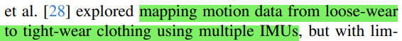

but with limited generalization capability. While some studies have employed IMUs attached to clothing for activity recognition tasks [14, 25, 31, 43], the challenge of sparse inertial sensing on loose-wear clothing is still under-explored.

(已有工作对于多个imu宽松服装运动数据到紧身衣的运动数据映射，泛化能力较差)

challenge：探索少传感器 - 宽松衣物 ->准确捕捉

****

### Hardware

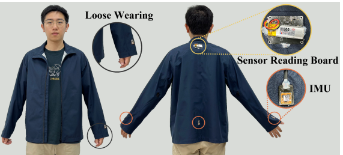

- upper body上半身运动跟踪

- loose-wear jacket宽松夹克原型- 100%聚脂钎维制成 XL（ 100% polyester and is designed in a standard size of XL）

- 4 IMU sensors（Xsens MTI-3）

  - left forearm

  - right forearm

  - back (integrated with the sensor reading 225 board)

  - waist

    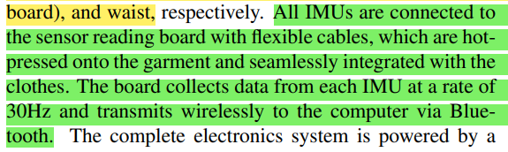

- 通过柔性电缆连接到传感器读取板上，被热压到衣服上，与衣服无缝集成，30Hz速率从每个IMU搜集数据，通过蓝牙无线传输到电脑
- Electronics System：LIthium battery (1000mAh)(一次充电用五个小时)

> ### Challenge 1 Hardware：
>
> 满足舒适性 ->皮肤与衣服之间松散耦合（不够紧）-> 产生二次运动 -> 干扰IMU的测量
>
> 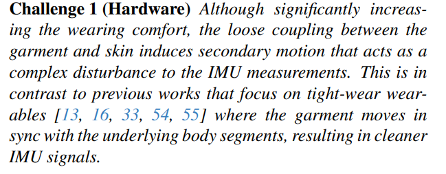

****

### Background and Problem Definition

利用IMUs进行姿态估计：

>$$θ(t) ∈ R ^{J*3} $$				在J个关节上定义的时刻t的三维旋转角度
>
>$$ s_{m}, m = 1, ..., M$$		服装内IMU传感器网络由M个IMU组成，位于$$ s_{m}$$​
>
>$$ a_{m}(t) ∈ R^{3}$$				IMU传感器 m 测量的t时刻加速度
>
>$$ R_{m}(t)∈R^{3*3}$$​			  IMU传感器 m 测量的t时刻旋转角度
>
>$$ p(t)∈R^{J*3}$$				关节位置

采用 two stage pipeline 来学习

$$ p(t)∈R^{J*3}$$	，$$θ(t) ∈ R ^{J*3} $$and $$IMU(t) =(\left \{ \alpha _{1}(t),\alpha _{2}(t),...,\alpha _{m}(t)  \right \},\left \{ R_{1}(t),R_{2}(t),...,R_{m}(t)  \right \} ) $$的映射：
$$
\begin{array}{l}
\mathbf{p}(t)=\operatorname{LSTM}(\operatorname{IMU}(t), \mathcal{H}), \\
\boldsymbol{\theta}(t)=\operatorname{LSTM}(\mathbf{p}(t), \operatorname{IMU}(t), \mathcal{H})
\end{array}
$$
$$\mathcal{H}$$表示lstm编码的运动历史，历史作为输入为LSTM的特点，历史运动会影响当前的编码结果；

$$ \mathcal(J)=10$$表示上肢关节

`由于腰部IMU穿戴比较宽松`对于骨盆的旋转需要单独估计

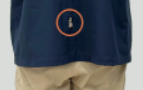

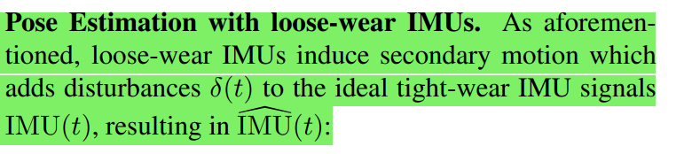

由于宽松穿戴->产生二次运动->与理想IMU(t)存在误差$$\delta (t)$$->导致$$\widehat{\mathrm{IMU}}(t)$$
$$
\widehat{\mathrm{IMU}}(t)=f(\operatorname{IMU}(t), \delta(t))
$$
`f`为未知函数, $$ \delta(t) $$ 由各种因素决定（比较复杂，影响IMU数据准确性因素）->对于不同穿戴条件要求高->鲁棒性不强

>### Challenge 2 Software
>
>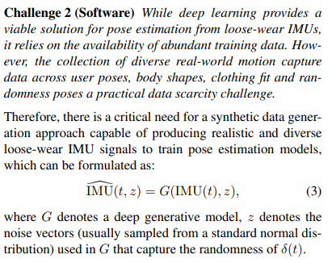
>
>深度学习已提供了方案（for 宽松穿戴IMUs 产生的误差）-> 依赖于大量训练数据的可用性- >对于搜集真实数据（稀缺）有挑战 -> 合成数据生成方法（生成真实和多样化的 宽松穿戴IMUs信号）
>$$
>\widehat{\mathrm{IMU}}(t，z)=G(\operatorname{IMU}(t,\mathcal{z})
>$$
>G 表示 深度生成模型
>
>$$\mathcal{z}$$表示G中使用的捕获$$\delta(t)$$随机性的噪声向量（通常从标准正态分布中采样）

****

### Secondary Motion AutoEncoder

#### 5.1 Noise-guided Latent Space Learning（噪声引导隐空间学习）

假设：

-  the IMU signal and the effects of secondary motion follow an additive relationship in the latent space（IMU信号和二次运动的影响在潜空间中遵循加性关系）`编码后相减得到误差`
- the latent  representation of the secondary motion (i.e., noise) follows a Gaussian distribution.（二次运动的在潜空间表示遵循高斯分布）`得到的z服从正态分布（通过训练->近似）`

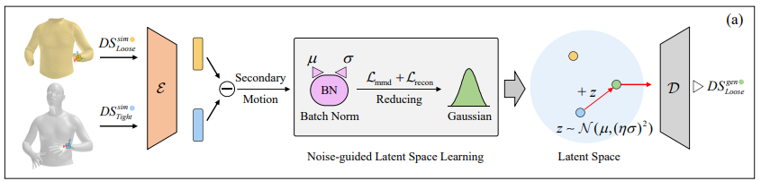

$$\varepsilon $$表示编码器

$$\mathcal{D}$$表示解码器

二次运动导致的误差$$ \delta(t) $$由$$\varepsilon(\widehat{\mathrm{IMU}}(t，z))-\varepsilon(\operatorname{IMU}(t))=z$$获得  z 服从正态分布

#### 传统方法 vs 噪声引导的潜在空间学习

- **传统方法** ->甚至学出来不一定符合预期假设
  - 在给定的潜在空间中，直接学习 z 的分布。
  - 潜在空间是固定的，模型通过数据训练来拟合 z 的分布。
  - 这种方法的问题是潜在空间的选择对结果有很大的影响，可能需要大量的数据和计算资源来得到一个合适的分布。
- **噪声引导的潜在空间学习**：->在假设2的基础上进行学习
  - 首先预定义 z的分布，使其符合正态分布 $$z \sim N(\mu, \sigma^2)$$。
  - 通过学习一个潜在空间，使得在这个空间中，z 的分布自动符合预先定义的正态分布。(`通过损失函数控制`)
  - 这种方法的好处是潜在空间的选择受到预定义分布的指导，从而简化了学习过程，并提高了模型的效率和稳定性。

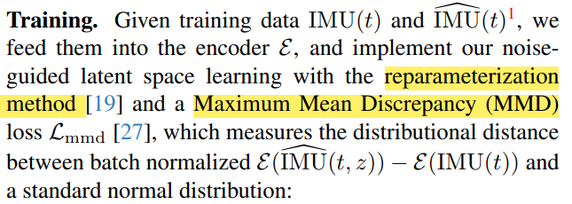

>### reparameterization method
>
>**将随机变量表示为确定性函数**：
>
>- 假设我们有一个随机变量 z 服从某个分布，例如高斯分布 z∼N(μ,σ2)。
>- 重参数化技巧将这个随机变量表示为一个确定性函数 g 和一个独立噪声变量 $$\epsilon$$ 的组合： $$z = \mu + \sigma \cdot \epsilon$$其中 $$\epsilon \sim N(0, 1)$$ 是标准正态分布的噪声。
>
>**梯度传递**：
>
>- 通过上述表示，采样过程变得确定性，依赖于模型参数$$\mu$$ 和 $$\sigma$$，而随机性部分由独立噪声变量 $$\epsilon$$ 提供。
>- 这样，梯度可以通过 $$\mu$$和$$\sigma$$ 进行反向传播，使得模型可以进行有效训练。

$$
\mathcal{L}_{\mathrm{mmd}}=\operatorname{MMD}(\operatorname{BN}(\mathcal{E}(\widehat{\operatorname{IMU}}(t, z))-\mathcal{E}(\operatorname{IMU}(t)))
$$

BN表示批量归一化层，批量归一化用于解决直接将$$E(\text{IMU}([t, z])) - E(\text{IMU}(t)) $$施加在一个特定的参数化高斯分布上的挑战，以减少模型训练过程中参数化分布带来的约束。

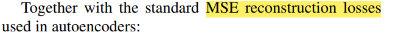
$$
\begin{array}{r}
\mathcal{L}_{\text {recon }}=\frac{1}{n} \sum_{i=1}^{n}\|\mathcal{D}(\mathcal{E}(\operatorname{IMU}(t)))-\operatorname{IMU}(t)\|_{2}^{2} \\
+\|\mathcal{D}(\mathcal{E}(\widehat{\operatorname{IMU}}(t)))-\widehat{\operatorname{IMU}}(t)\|_{2}^{2},
\end{array}
$$
最终实现整体的损失函数为：
$$
\mathcal{L}=\mathcal{L}_{\text {recon }}+\mathcal{L}_{\text {mmd }}
$$
经过训练 - >得到z->可以合成多样化的loose-wear IMU数据：
$$
\widehat{\operatorname{IMU}}(t, z)=\mathcal{D}(\mathcal{E}(\operatorname{IMU}(t))+z)
$$
其中 $$z \sim N(\mu, \sigma^2)$$，$$\mu, \sigma$$都是由BN（批处理归一化层）得到

引入$$\eta $$为了生成更高水平的合成数据(本文工作中$$\eta = 2$$)：
$$
z \sim N(\mu, (\eta\sigma)^2)
$$

### 5.2 Temporal Coherence Scheme

上述合成公式当中忽略了运动序列当中连续帧之间二次运动的相干性 - >提出将z线性插值到z(t)当中
$$
z(t)=\left(1-\frac{t}{n}\right) \cdot z(1)+\frac{t}{n} \cdot z(n)
$$

- 其中z(1) 和z(n) 服从参数为 $$\mu$$ 和 $$(\eta \sigma)^2$$的正态分布 $$N(\mu, (\eta \sigma)^2)$$。
- n 是一个用户指定的超参数，控制插值的长度。更大的 n 会生成更平滑的合成IMU信号。
- 使用插值后的噪声z(t)生成t处的IMU信号：（n=2,退化为z）

$$
\operatorname{IMU}(t, z(t))=D(E(\operatorname{IMU}(t))+z(t))
$$

- 实际工作中n = 128

****

### Experiments

#### 6.1 dataset and Metrics

#### simulation dataset:

使用宽松穿戴和紧密佩戴数据配对模拟IMU数据，用于训练SeMo-AE

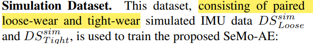

**DSsimLoose**（松穿数据集）：

1. **使用TailorNet模拟服装模型**：
   - TailorNet是一种可以快速模拟服装模型的工具，特别适用于拓扑一致的服装模拟。
   - 数据来源于AMASS数据集，该数据集包含超过900万个帧。
   - TailorNet根据SMPL姿态和体型生成拓扑一致的服装模型。
2. **选择合适的服装模型**：
   - 从作者提供的服装模型中选择了最类似于松穿夹克的衬衫模型（Shirt model）。
3. **配置SMPL模型的体型**：
   - 为了确保服装和皮肤之间有较大的空间，SMPL模型的体型被设置为“Tall Thin”（高瘦）。
   - 这种配置更准确地代表了松穿的场景。
4. **模拟过程和硬件**：
   - 这单次模拟在NVIDIA RTX 4080显卡上进行了大约4天。
5. **IMU数据的模拟**：
   - 在模拟的服装上选择了4个靠近的顶点，描述两个轴的方向。
   - 通过叉积计算第三轴的方向，模拟方位测量。
   - 使用这四个顶点的几何中心作为IMU的位置，进行加速度的模拟。

**DSsimTight**（紧穿数据集）：

- **直接放置虚拟IMU**：
  - 使用上述方法将虚拟IMU直接放置在人体网格上。
  - 人体网格从AMASS数据集中获得。
- **调整关节和网格顶点设置**：
  - 以匹配上半身IMU设置（左前臂、右前臂、背部和腰部）。

通过提出的SeMo-AE按需合成松穿IMU数据

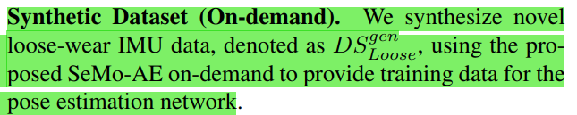

#### 真实世界测试数据集（DSrealLoose）

1. **参与者**
   - 招募了五位体型各异的参与者。
   - 参与者穿戴整合了四个IMU的松穿夹克进行数据收集。
   - 参与者签署了知情同意书，其体型适合设计的衣物。
2. **数据收集**
   - 参与者以两种穿戴方式（拉链拉上和拉开）进行数据收集。
   - 每个参与者被要求进行五种预定义动作（行走、跑步、跳跃、拳击和乒乓球）以及五次自由动作，每个动作持续一分钟。
   - 使用Perception Neuron 3系统捕捉上半身姿态，采用11个紧穿IMU作为地面真值。
   - 总共收集了212,376帧，帧率为30 fps，总时长约2小时。

#### Metrics

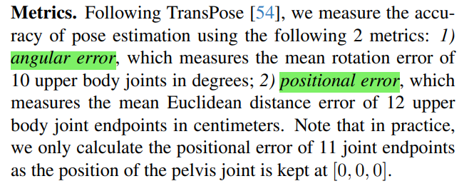

**角度误差（Angular Error）**：

- 测量10个上半身关节的平均旋转误差（单位：度）。

**位置误差（Positional Error）**：

- 测量12个上半身关节端点的平均欧几里德距离误差（单位：厘米）。
- 实际计算时只考虑11个关节端点的位置误差，因为骨盆关节的位置固定在[0, 0, 0]。

#### Tranning Details

#### IMU DATA FORMAT:

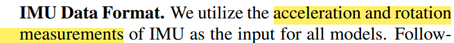

- 我们使用IMU的加速度和旋转测量作为所有模型的输入数据。

##### 数据处理

1. **数据归一化**：
   - 我们按照TransPose的方法对IMU数据进行归一化处理。
   - 将左、右和背部IMU的加速度和旋转测量转换为相对于腰部IMU的相对值。
2. **旋转测量的6D表示**：
   - 为了便于姿态估计网络的训练，我们将IMU的旋转测量转换为其相应的6D表示。
   - 6D表示通常指欧拉角或四元数等形式，用于表示旋转的所有自由度。

我们将IMU数据定义为 $$I \in \mathbb{R}^{36}$$。

其中，IMU数据由4个IMU的三轴加速度和6D旋转组成。因此，$$I$$的维度为$$(3 + 6) \times 4 = 36$$

#### Trainning Setting

##### 实验环境和计算机配置

- 实验在一台配置了Intel(R) Core(TM) i7-13700KF CPU和NVIDIA RTX 4080 GPU的计算机上运行。
- 使用的深度学习框架为PyTorch 1.12.1，并且CUDA版本为11.3。

##### SeMo-AE模型训练

- SeMo-AE模型使用了DSsimLoose和DSsimTight两个数据集进行训练，其中批量大小为512。
- 训练过程中采用了Adam优化器，学习率设置为1 × 10^(-3)。

##### 姿态估计网络训练

- 姿态估计网络使用了DSgenLoose数据集进行训练，批量大小为256。
- 训练过程中同样采用了Adam优化器，学习率设置为5 × 10^(-4)。

#### Comparison with SOTA Methods

##### Quantitative Results

- 与其他最先进方法进行了比较，这些方法包括DIP、IMUPoser、TransPose、TIP和PIP。
- 由于这些最先进方法是为紧身穿戴IMU设计的，具有不同的传感器数量和安装位置，因此使用了这些方法的官方代码，并在DSsimLoose数据集上重新训练了模型，并在DSrealLoose上报告了角度和位置误差。(误差最小)

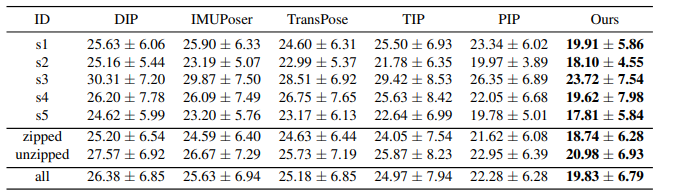

角度误差（度）

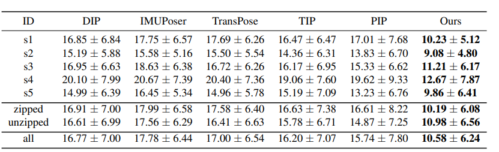

位置误差（厘米）

##### Qualitative Results

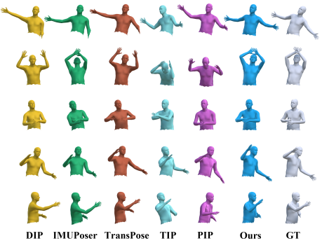

定性比较展示了他们的方法在处理二次运动方面的优势。相比于当前最先进方法，作者的方法在所有动作中都能够保持稳定且准确的运动捕捉，这突显了该方法的优越性。

#### Ablation Study（探究是否有效生成数据）

##### Quantitative Results

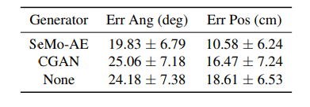

由cGAN生成的松穿IMU数据与不使用合成数据（“None”，直接在DSsimLoose上训练）相比几乎没有改进，表现远远不及SeMo-AE。

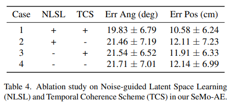

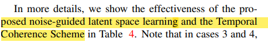

在第3和第4案例中，通过整个数据集上E(IMU) - E(IMU)的统计信息来获取潜在空间中附加高斯噪声的μ和σ。

##### Qualitative Results.

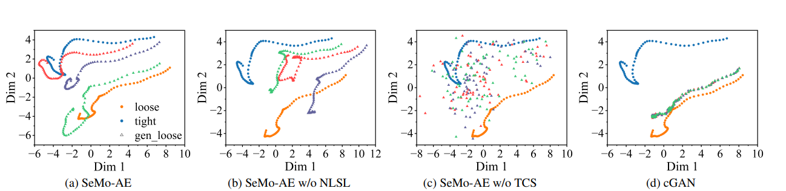

1. 移除所提出的噪声引导的潜在空间学习（NLSL）导致合成的松穿IMU数据DSgenLoose中出现异常的空间模式； 
2. 移除所提出的时间连贯性方案（TCS）将DSgenLoose转变为噪声样式的信号，与DSsimLoose显著不同；
3. 由cGAN生成的DSgenLoose表现出最小的多样性，表明它忽略了输入噪声并未能模拟次级运动的影响。

#### Live Demo

python & unity

系统持续接收实时的IMU数据，使用类似于TransPose 的校准和归一化方法对其进行处理，将其馈送到姿势估计模型中，并显示实时的动作捕捉结果。

#### Limitations and Future Work

**Limitations**

**硬件方面：** 由于成本限制，目前只有一件服装可用。服装尺寸和面料材质对准确性的影响尚未全面研究，而夹克上的电路和传感器未经防水处理，无法进行常规洗涤。

**软件方面：** 尽管SeMo-AE显著增强了松散穿着IMU数据的丰富性，但生成的数据无法涵盖所有穿着方式，导致姿势估计误差增加，特别是在未拉链穿着时更为明显。

**Future Work**

**数据收集：** 收集更大规模的连续人体运动数据，涵盖不同的穿着风格、身材尺寸和服装类型，为长期健康监测等应用提供基础。

**技术改进：** 针对硬件限制，改进夹克设计以提高舒适度和耐用性，并对电路和传感器进行防水处理。在软件方面，改进SeMo-AE模型以更好地模拟不同的穿着方式，并减少姿势估计误差。

**应用拓展：** 探索更广泛的应用场景，例如长期健康监测、运动训练等领域，以提高系统的实用性和可用性