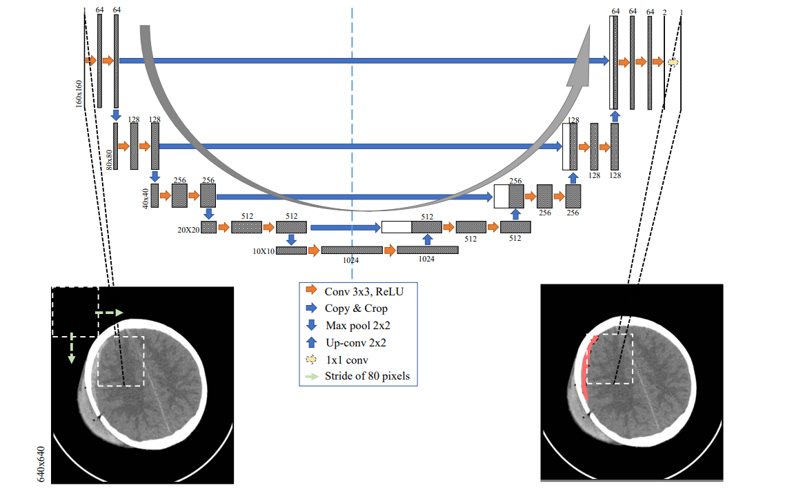
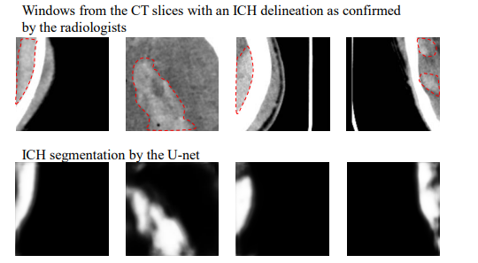
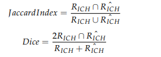
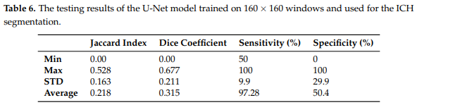
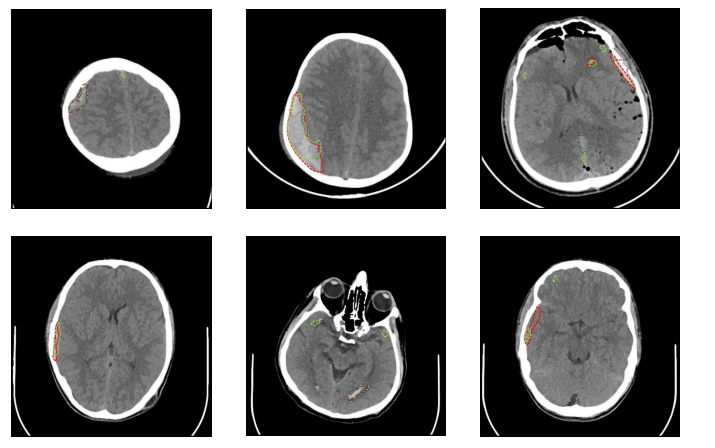

# 人工智能（Intracranial Hemorrhage Segmentation Using a Deep Convolutional Model）

****

### 数据收集：

- 2018.2 ~ 2018.8 

- Al Hilla Teaching Hospital-Iraq

- CT扫描仪：Siemens/SOMATOM Ddfinition AS

- 样本来源

  

- Syngo 读取CT DICOM文件，保存两段视频（.avi）
  - garde ：40 width：120 脑窗口开窗后的视频
  - grade : 700 width: 3000 骨窗口开窗后视频
  - 保存了每个CT切片650 * 650 JPG格式的灰度图像
  
- U—NET架构
  
  - > 
    >
    > - feature map : 特征图，下图灰白色部分
    > - 橙色箭头：3*3卷积，用于特征提取
    > - 蓝色箭头：skip-connection,用于特征融合（`copy and crop`中的`copy`就是`concatenate`而`crop`是为了让两者的长宽一致）
    > - 向下的蓝色箭头：表示池化 pooling，用于降低维度
    > - 向上的蓝色箭头：表示上采样upsample，用于恢复维度
    > - 淡黄色箭头：1*1卷积，用于输出结果
  
  - 160*160 间距 80像素，将CT切片成49个窗口
  
    
  
  - 参数说明：
  
    - 每一个区块由两个3*3的卷积滤波层和填充层构成 => 一个整流线性单元（ReLU）=> 
  
      2*2最大池化层（每次维度减少1，即特征量/2）
  
    - 24个卷积层
  
    - 4个最大池化层
  
    - 4个上采样层（与池化对应）
  
    - 4个连接层
  
    - 未使用密集层
  
  - 结果
  
    3次实验
  
    - **第一次实验：**采用 grid search（网格化搜索）寻找ICH区域的最大与最小阈值
  
      - 训练数据选择 - jaccard指数最高的阈值
  
        >jaccard指数
        >
        >是一种用于比较两个集合之间相似程度的统计指标。它通常用于计算两个集合的重叠程度，特别是在数据挖掘和信息检索等领域中常被使用。
        >$$
        >J(A,B)= \frac{∣A∪B∣}{∣A∩B∣} ​
        >$$
        >
        >- *A* 和 𝐵是两个集合；
        >- ∣𝐴∣表示集合 𝐴*A*的元素数量；
        >- ∣𝐴∩𝐵∣表示集合 𝐴和 𝐵 的交集的元素数量；
        >- ∣𝐴∪𝐵∣表示集合 𝐴和 𝐵 的并集的元素数量。
        >
        >Jacarrd相似度的取值范围在 0 到 1 之间，数值越接近于 1 表示两个集合的重叠程度越高，相似度越大；而数值越接近于 0 表示两个集合之间的重叠程度越低，相似度越小。
  
      - 使用完整的640*640完整CT切片会导致模型的结果偏向负类 - ICH阴性
  
    - **第二次实验：**使用完整的640*640CT切片对Unet模型进行训练和测试（验证结果偏向负类）
  
      - 发现使用160*160窗口相比完整切片可以获得更加精确的模型
  
    - **第三次实验：**将CT切片分割成多个160*160的窗口，
  
      - 通过U-net进行分割，得到的小窗口掩码映射回原始CT切片
      - 对于重叠的掩膜求平均值**(间隔80像素=>产生重叠)**，边缘和角落的像素除外（不重要）
  
  - 实验评估
  
    使用了切片级别的Jaccard指数和Dice相似系数来量化模型在每个CT切片上分割结果与黄金标准分割之间的拟合程度。
  
    - **RICH**表示神经学家的分割结果
  
    - **R^ICH**表示由U-Net产生的分割结果
  
      
  
    
  
  - 所有实验采用基于主题的5折交叉验证来训练、验证和测试所开发的模型。
  
    >5折交叉验证是一种常用的模型评估技术，通常用于评估机器学习模型的性能。它将数据集分成5个相似大小的子集，称为折叠（folds）。然后，模型会被训练和评估5次，每次使用其中4个折叠进行训练，剩下的1个折叠用于验证模型的性能。
    >
    >1. 将数据集分成5个相等大小的子集。
    >2. 选择其中4个子集作为训练集，剩下的1个子集作为验证集。
    >3. 使用训练集来训练模型，并在验证集上评估模型的性能。
    >4. 重复步骤2和3，直到每个子集都被用作验证集，每个模型都被评估了一次。
    >5. 对所有评估得到的性能指标进行平均，得到最终的性能评估。
  
  - 在第一个实验中，实施了一个网格搜索，以选择100到210范围内的较低阈值和210到255范围内的较高阈值。这个过程导致了阈值为140和230，测试Jaccard指数为0.08，Dice系数为0.135。
  
  - 第二和第三个实验中使用Keras库和TensorFlow作为后端实现了U-Net架构
  
  - 数据集当中82个受试者（36个被诊断为ICH）为了避免有ICH和无ICH的数据之间的任何类别不平衡问题，对训练数据进行了随机欠采样，并将无ICH数据的数量减少到与ICH数据相同的水平。
  
  - 在每次交叉验证迭代中，将一部分CT扫描作为保留集合进行测试，一部分用于验证，三部分用于训练。U-Net在640×640的CT切片或160×160的窗口及其对应的分割窗口上进行了150轮的训练。
  
  - 对数据进行增强（线性变换减少由于数据集的被踩记者的年龄差异所造成误差）：
  
    - 最大20度的旋转
    - 最大图像宽度的10%的宽度偏移
    - 最大图像高度的10%的高度偏移
    - 最大强度为0.1的剪切
    - 最大范围为0.2的缩放
  
  - 训练过程的优化器，损失函数和学习率
  
    - Adam优化器
  
      > dam是一种常用的随机梯度下降算法的变种，它结合了动量和自适应学习率机制。Adam优化器可以帮助模型更快地收敛到局部最优解，并且对超参数的选择相对不敏感。
  
    - 交叉熵损失
  
      > 交叉熵损失是用于分类问题的损失函数，它衡量了模型输出与真实标签之间的差异。在训练过程中，模型的目标是最小化交叉熵损失，从而使模型的预测尽可能接近真实标签。
  
    - 学习率1 × 10^−5
  
      >习率是控制模型参数更新步长的超参数。在每次参数更新时，学习率决定了参数在梯度方向上的移动大小。这里的学习率为1 × 10^−5表示学习率的大小为0.00001，即非常小。较小的学习率通常用于保证模型收敛的稳定性，尤其是在训练过程中需要更细致的调整参数时。
  
  - 第二个实验使用了大小为2的小批量，第三个实验使用了大小为32的小批量。在每个epoch后对训练模型进行了验证。保存了验证Jaccard指数最低的最佳训练模型，并用于测试。训练评估指标是平均交叉熵损失。
  
  - **第一个实验**：
  
    - 使用了网格搜索来选择ICH区域分割的阈值，最终选择了140和230作为阈值。
    - 测试Jaccard指数为0.08，Dice系数为0.135。
    - 该实验未使用U-Net架构。
  
  - **第二个实验**：
  
    - 使用U-Net架构，在完整的640×640 CT切片上进行训练和测试。
    - 在测试中，U-Net未能正确检测到任何ICH区域，导致只生成了黑色掩码（即，未检测到ICH的负类）。
    - 受限于数据集中ICH像素数量较少的问题，导致模型偏向于未检测到ICH的负类。
  
  - **第三个实验**：
  
    - 采用了窗口化的160×160 CT切片，并对负窗口进行了欠采样。
  
    - U-Net在经过窗口化处理后的数据集上进行了训练和测试。
  
    - 在测试中，U-Net对ICH区域的检测性能得到了明显改善，Dice系数为0.31。
  
    - 测试Jaccard指数为0.21，Dice系数为0.31。切片级别的敏感性为97.2%，切片级别的特异性为50.4%
  
      
  
    - 进一步对预测概率掩码的阈值进行调整，可以在测试特异性和敏感性之间进行平衡。
  
    - 预测结果
  
      
  
  - **ICH亚型结果显示**
    基于ICH亚型的结果显示，对于SDH分割，U-Net表现最佳，Dice系数为0.52。对于EDH、IVH、IPH和SAH的分割，平均Dice分数分别为0.35、0.3、0.28和0.23。在表6中，当U-Net未能定位两个受试者CT扫描中的ICH区域时，最小的Dice系数和Jaccard指数为零。其中一个受试者在一个CT切片中只有一个小的IPH区域，另一个受试者在两个CT切片中只有一个小的IPH区域。这些受试者的IPH区域的宽度和高度都小于10毫米，这设定了所提出的U-Net架构对ICH分割的下限。基于受试者年龄的结果显示，18岁以下受试者的Dice系数为0.321，18岁以上受试者的Dice系数为0.309。这个分析证实了在18岁以下和18岁以上受试者之间，该方法的性能没有显著差异。
