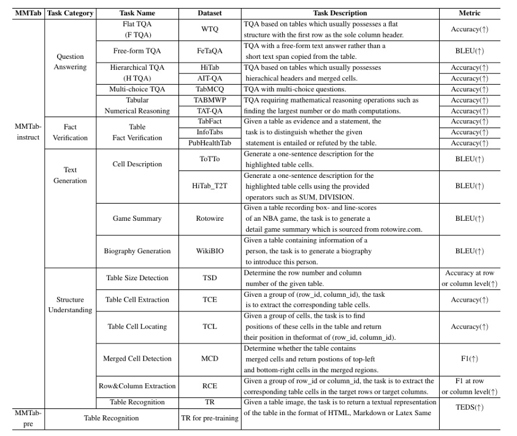
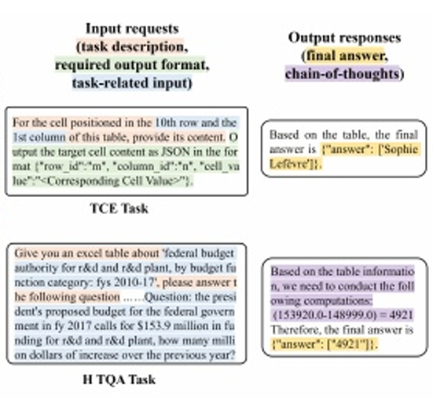
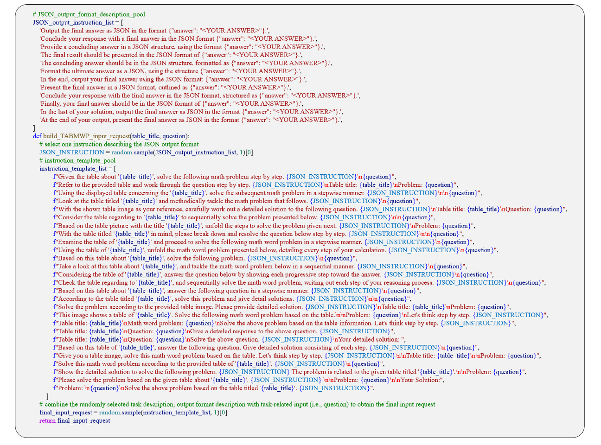
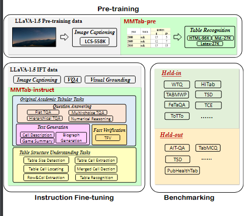
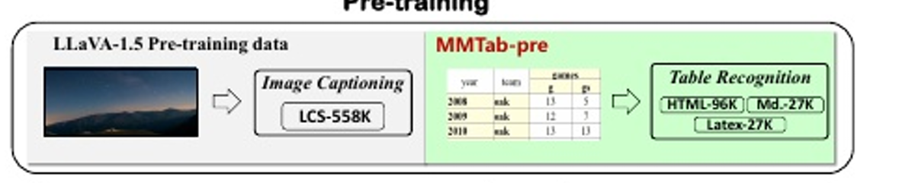

# MultimodalTableUnderstanding

****

### KEY WORD：

- **Cell Description：**对于单元格元素进行解释说明
- **Flat Table Question Answering (TQA)**:TQA 是指针对表格数据的问答系统。在这个系统中，用户可以提出与表格内容相关的问题，系统会根据表格中的数据返回答案。 “Flat” 可能意味着表格是简单的、平面的，没有嵌套或复杂的层次结构。

- **benchmarking**：基准测试，需要通过性能指标测试

- **ViT（visual transformer）**：将Transformer应用在图像分类的模型

- **MLP（Multi-Layer Perceptron）**：也称人工神经网络

- **Vicuna Model** 开源的大语言模型

- **MLMS （Masked Language Model）**即指多个掩码语言模型。掩码语言模型是一种用于自然语言处理的模型，通过预测被掩码掉的单词或词语来学习语言的表示和结构。最著名的掩码语言模型之一是 BERT (Bidirectional Encoder Representations from Transformers)。

  

****

#### SOTA缺陷（开源模型）：

- 需要将表格数据转换成特定的文本序列 - MarkDown/Html
- 无法从视觉角度解释表格数据（从图像/PDF）
- 完成其他的多模态任务表现出色，但是在所提出的表格相关任务接近0性能

****

### Motivation

- 解释图像（PDF/PNG ...）表格数据
- 通用模型 -> 执行基于表的任务

****

### Work

- MMTab 数据集构建，针对**多模态表理解问题**

  - 将原始文本转换为表图像
    - 原始文本作为label评价模型
  - 数据集构成
    - 108K具有广泛表结构覆盖的表图像
    - 150K用于预训练的表识别样本（MMTab-pre）
    - 232K用于指令调优的15个基于表的任务样本(mmtab指令)
    - 49K用于评估的样本

- Table-LLaVA 多模态大语言模型

  - 增强的两阶段训练范式

    - MMTab-pre上使用额外的表示别任务预训练

      ```要求模型基于表图像生成文本序列```

    - 使用mmtab指令各种基于表的下游任务对模型进行指令调优

****

### Related Work

#### Table Understanding（TU）

> KEY : 如何从表格数据中自动提取，转换和解释基本信息

#### Multimodal Large Language Models

> KEY：
>
> - 集成了视觉编码器和llm之间的交叉注意机制
> - 提出线性层作为更简单的跨膜态连接器

#### MMTab 数据集

> - 8个领域14个公共表数据集（table 1 前行）```涵盖了9个具有代表性的学术任务的详细定义```
>
> - 学术任务的定义 - table 6
>
> - 通过python脚本将 表（html/md）-> 表图像
>
> - 要求模型的输出为json格式
>
> - 格式统一 为<表图像，输入请求，输出响应>
>
>   
>
> - 数据对应
>
>   - 表级对应（对于表格进行理解，属性/属性值）
>
>   - 指令级对应（对于表格相关问题进行对应）
>
>     - 输入请求和表图像
>
>     - 请求会与指令模板结合输入（例如解决数学问题->求和.....）
>
>       
>
>   - 任务级别
>
>     ```难以理解表格结构,但在理解表的前提下的下游任务性能好```
>
>     - 解决学术任务 例如 flat TQA 和 Cell Description

将表识别任务作为多模态表理解的重要与训练任务

****

### MMTab优点：

- 数据量大
- 多元结构，样式和domain
- 包含广泛的表格任务

****

### Table-LLaVA

依据所建立的数据集MMTab来提高模型的多模态表理解能力

两阶段训练程序：

- pre-training

- instruction fine-tuning 指令微调
  - benchmarking 基准测试（通过性能指标的测试）



****

### Model Architecture

- **视觉编码器**：预训练的ViT模型
  - ViT模型将输入的图像编码为视觉特征，然 后对其进行识别

- **视觉语言连接器**： 两层MLP
  - MLP连接器投影到LLM的词嵌入空间中。
- **主干LLM** Vicuna模型
  - Vicuna将处理后 的视觉特征和嵌入的文本特征的拼接作为输入来生成响应。

****

### Model Training

- 使用MMTab-pre数据集上的表识别任务对**视觉语言连接器**进行预训练

  - 要求模型输出包含表结构和表内容的文本表表示（通过文本对于表格进行描述，可以是HTML，MD格式）

  

- 指令微调

  预先训练好的**视觉语言连接器** 和**LLM**联合对多模态表任务和传统多模态任务的指令跟随数据进行微调。

****

### Experiment

**考虑三种类型基线（都是开源模型）**

- 开源 mlms
- 开源的大预言模型Open-source LLMs including Llama2
- The GPT-4V with low or high image resolution.（只随机选择100~200个测试样本）

**评价指标**

- 对于TQA，TFV，T2T基准
  - 使用准确性或BLEU
- TSD
  - 计算预测行数和列数的准确性
- TCE，TCL
  - 单元级计算精度
- MCD
  - use cell-level F1(**评估多标签分类任务中每个类别的预测精度**)

- RCE
  - cell-level F1 for extracted rows and columns,414respectively

- Table Recognition (TR) （range（0,1））
  - use the Tree-Edit-Distance-based Similarity (TEDS) score(基于树编辑距离的相似性 (TEDS)评分)
  - 基于HTML表序列的树结构，开源测量预测和实际之间的结构相似性和单元格内容的相似性

